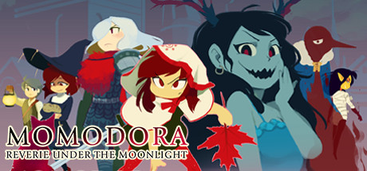
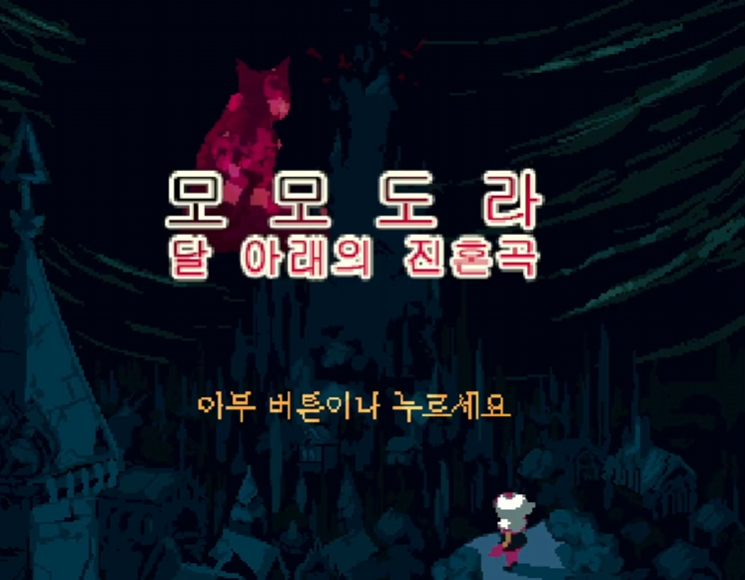
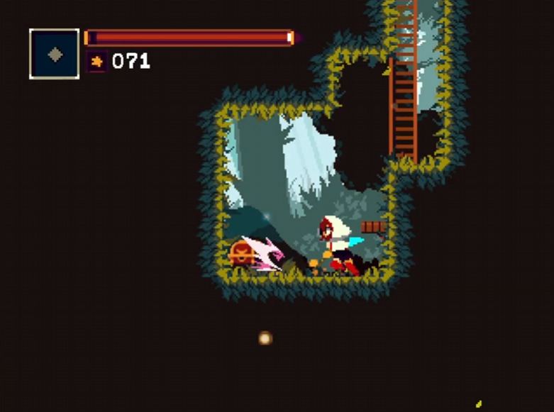
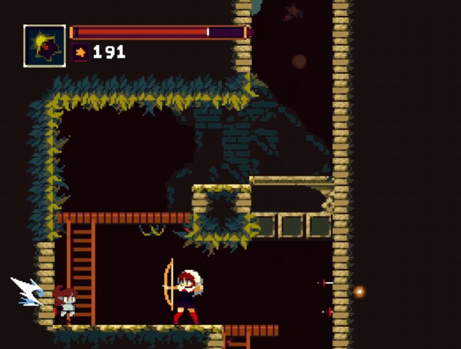
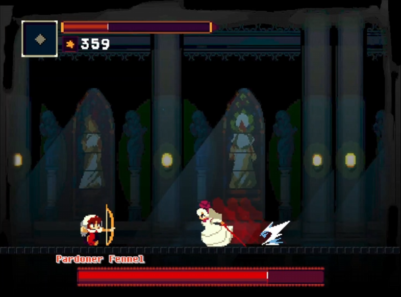
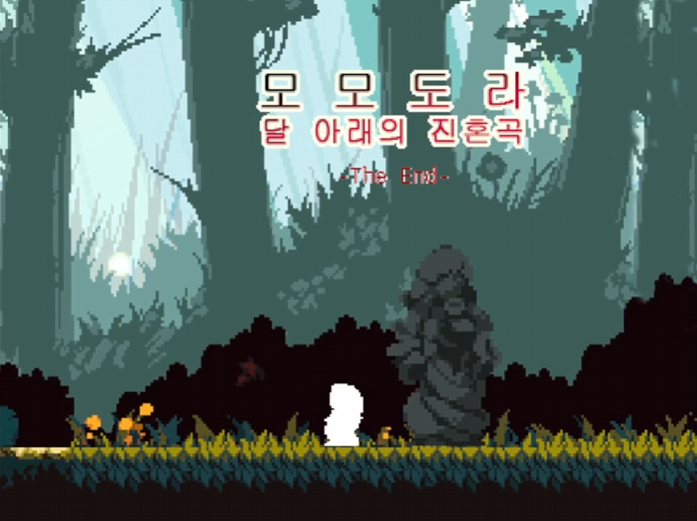
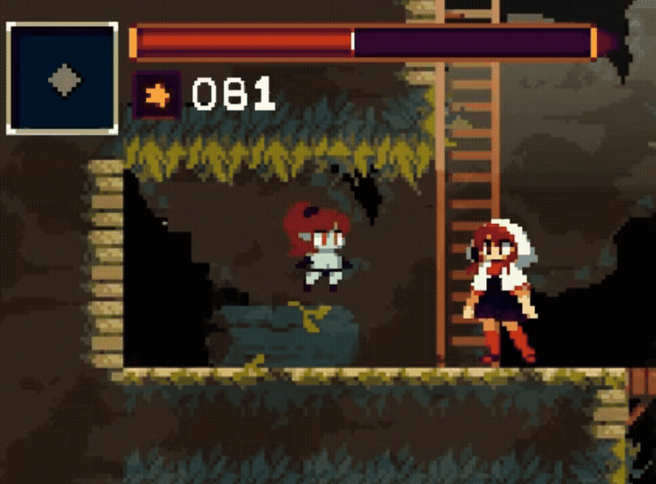
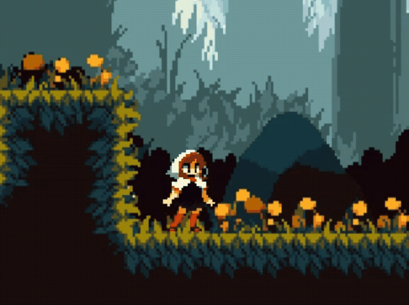

# 모모도라:달 아래의 진혼곡 모작

  

## 🎮 프로젝트 소개

WinAPI 기반으로 제작한 2D 액션 메트로베니아 모작 프로젝트입니다.

게임 엔진을 사용하지 않고 WinAPI 환경에서 플레이어 이동, 점프, 공격, 차징 공격, 몬스터 전투, 인벤토리, Save / Load 시스템을 직접 구현하였습니다.

상태 기반 구조를 활용하여 플레이어의 다양한 행동을 관리하였으며, Hit Stop과 이펙트를 적용하여 2D 액션 게임의 타격감을 표현하고자 하였습니다.

---

## 📅 개발 기간

2025.06.19~2025.07.01
(약 2주)

---

## 👨‍💻 개발 인원

1명 

---

## 🛠 개발 환경

### Language
- C,C++

### SDK
- WindowsAPI(WinAPI)

### Tools
- Visual Studio 2019

---
## 📌 담당 구현 기능

- 플레이어 이동 및 액션 시스템
- 상태 기반 전투 시스템
- 콤보 공격 및 차징 공격 시스템
- 활 공격 및 투사체 시스템
- 몬스터 AI 및 보스 전투 시스템
- Hit Stop / 카메라 쉐이킹 전투 연출
- 인벤토리 및 아이템 사용 시스템
- 파일 입출력 기반 Save / Load 시스템
- 맵 에디터 및 데이터 파싱 시스템
- 세이브 포인트 / 이벤트 진행 상태 저장
---

## 🎥 시연 영상

[\[YouTube 링크\]](https://www.youtube.com/watch?v=9n5yCr9qoXs)

---

## 📷 프로젝트 이미지

|타이틀화면|인게임 스크린샷1|
|:---:|:---:|
|||

|인게임 스크린샷2|인게임 스크린샷3|
|:---:|:---:|
|||

   
  <em>엔딩 화면</em>

---

# ⭐ 주요 구현 사항

## 1. 상태 기반 플레이어 액션 및 전투 시스템

### 개요

플레이어의 이동, 점프, 공격, 활 공격, 회피 등 다양한 액션을 상태 기반으로 관리하여 2D 액션 전투 시스템을 구현하였습니다.

### 주요 내용
플레이어의 행동을 IDLE, WALK, ATTACK, JUMP, BOW, ROLL, HIT, SAVE, TALK 등 상태로 분리하여 관리하였습니다.

각 상태에 따라 입력 처리와 애니메이션이 전환되도록 구성하였으며, 공격 상태에서는 무기 충돌체를 활성화하여 적과의 전투 판정이 이루어지도록 구현하였습니다.

## 2. 콤보 및 차징 공격 시스템

|콤보|차징|
|:---:|:---:|
|||

### 개요

연속 공격과 차징 공격을 구현하여 전투의 조작감과 타격감을 강화하였습니다.

### 주요 내용

공격 입력 시간 간격을 기준으로 콤보를 관리하였으며, 일정 시간 이상 공격이 이어지지 않으면 콤보가 초기화되도록 구현하였습니다.

일반 공격은 최대 3단 콤보로 구성하였고, 각 콤보 단계에 따라 다른 공격 상태와 애니메이션이 실행되도록 처리하였습니다.

활 공격은 차징 시간에 따라 강화되도록 구현하였으며, 최대 차징 시 여러 방향으로 화살을 발사하여 일반 공격과 다른 전투 흐름을 만들었습니다.

## 3. AI 기반 NPC 상호작용 시스템

### 개요

게임 내 NPC와 자연스럽게 대화할 수 있도록 OpenAI API 기반 NPC 대화 시스템을 구현하였습니다.

### 주요 내용

플레이어가 NPC와 상호작용하면 대화 UI가 활성화되고, 입력한 문장을 OpenAI API로 전달하여 응답을 생성하도록 구현하였습니다.
NPC 역할과 게임 세계관 정보를 프롬프트에 포함하여 상황에 맞는 대화가 출력되도록 구성하였으며, 대화 내용을 리스트로 관리하여 이전 대화 흐름을 이어갈 수 있도록 설계하였습니다.

## 4. 수질 정화 시스템

### 개요

생존에 필요한 물 자원을 확보할 수 있도록 물 수집, 정화, 회수 과정을 포함한 물 정화 시스템을 구현하였습니다.

### 주요 내용

플레이어는 수집한 물병을 정화 장치에 장착하여 정화 과정을 진행할 수 있습니다.

물병 장착은 Socket 기반 상호작용 구조를 활용하여 구현하였으며, 정화가 시작되면 물의 상태를 실시간으로 관리하도록 구성하였습니다.

또한 Shader Property를 활용하여 정화 진행 상태를 시각적으로 표현하였고, 정화 완료 시 물 오브젝트의 상태가 변경되도록 구현하여 단순 타이머가 아닌 실제 정화 과정을 확인할 수 있도록 설계하였습니다.

## 5. 마이크 입력 기반 환경 상호작용 시스템

### 개요

VR 환경의 몰입감을 높이기 위해 마이크 입력을 활용한 환경 상호작용 시스템을 구현하였습니다.

### 주요 내용

마이크 입력 음량을 실시간으로 측정하여 일정 수준 이상의 소리가 감지되면 먼지(Fog)가 제거되도록 구현하였습니다.

AudioLoudnessDetection을 활용하여 음량을 분석하고, 임계값 이상이 유지될 경우 파티클 및 오브젝트 상태가 변경되도록 구성하였습니다.

이를 통해 버튼 입력 중심의 상호작용에서 벗어나 실제 음성 입력을 게임 플레이에 활용하는 VR 환경 특화 콘텐츠를 구현하였습니다.

---
# 🔧 Trouble Shooting - VR 콘텐츠 최적화

## 🔴 ISSUE
VR 생존 게임 프로젝트 진행 중 대규모 맵과 다수의 상호작용 오브젝트를 배치하면서 심각한 성능 저하가 발생하였습니다.

VR 기기에서 평균 프레임이 20~30FPS 수준까지 하락하였고, 이는 VR 멀미를 유발할 수 있는 수준이었습니다.

## 원인

원인을 분석한 결과, 맵에 배치된 수많은 오브젝트가 씬 로딩 시점부터 활성화되어 렌더링 및 메모리를 지속적으로 점유하고 있음을 확인하였습니다.

## 해결

초기에는 모든 오브젝트를 Unity Scene에 직접 배치하는 구조를 사용하였습니다.

하지만 맵 규모가 커질수록 오브젝트 수가 증가하며 성능 문제가 발생하였고, 이를 해결하기 위해 오브젝트 배치 정보를 데이터로 관리하는 구조를 도입하였습니다.

위치(Position), 회전(Rotation), 크기(Scale) 정보를 JSON 형태로 저장하고, 게임 실행 시 필요한 시점에 오브젝트를 생성하도록 구조를 변경하였습니다.

이를 위해 Unity JSON 직렬화 및 파싱 기능을 학습하여 데이터 기반 오브젝트 배치 시스템을 구현하였습니다.

## 결과

### Before

🔴 평균 FPS : 20 ~ 30 FPS

### After

🟢 평균 FPS : 40 ~ 50 FPS

데이터 기반 오브젝트 배치 시스템 적용 후 평균 프레임이 약 2배 향상되었습니다.

또한 배치 정보를 데이터로 관리하게 되면서 레벨 수정 및 유지보수가 수월해졌고, 향후 맵 확장에도 유연하게 대응할 수 있는 구조를 구축할 수 있었습니다.

---

# 💡 느낀 점

이번 경험을 통해 최적화는 개발 후반에 해결하는 문제가 아니라 설계 단계부터 고려해야 하는 요소라는 점을 배울 수 있었습니다.

또한 단순히 성능 문제를 해결하는 것에 그치지 않고, 데이터 기반 구조를 도입하여 성능과 유지보수성을 함께 개선할 수 있다는 점을 경험하였습니다.

이 경험을 계기로 VR 콘텐츠 최적화에 관심을 갖게 되었고, 이후 [「 VR 기기를 활용한 3D 콘텐츠 최적화 방안 연구」](https://scienceon.kisti.re.kr/commons/util/originalView.do?cn=JAKO202434141741183&dbt=JAKO&koi=KISTI1.1003%2FJNL.JAKO202434141741183)논문을 작성하여 KCI 학술지 게재라는 성과로 이어질 수 있었습니다.

---

# 🔗 링크

- Notion : [바로가기](https://www.notion.so/native/P-O-S-Planet-of-Restorers-3702e3fb387b804d9360ca027d92b72c?source=copy_link&deepLinkOpenNewTab=true)